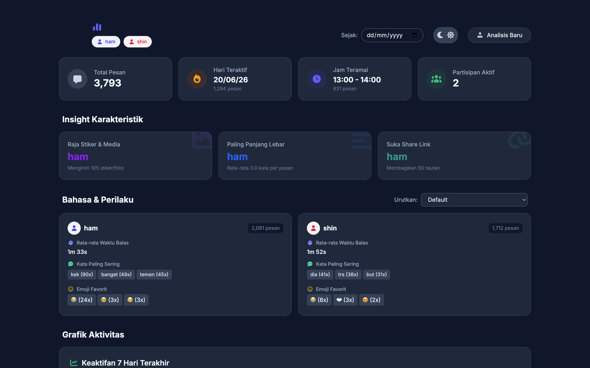

<p align="center">
  
  
  
  
</p>


# Chanalysis

Chanalysis adalah aplikasi desktop untuk menganalisis riwayat chat WhatsApp secara lokal. Anda dapat mengekspor chat dari WhatsApp dalam format `.txt` dan mengunggahnya ke aplikasi ini untuk melihat statistik dan visualisasi pola komunikasi secara offline.

> **Privasi Data**: Semua proses analisis dilakukan sepenuhnya di perangkat Anda secara lokal. Tidak ada data yang dikirim ke server luar.

---

## Fitur

- **Dashboard Statistik**: Menampilkan total pesan, hari teraktif, jam teramai, dan jumlah partisipan.
- **Analisis Karakteristik**: Mengetahui pengirim stiker/media terbanyak, rata-rata panjang pesan, dan jumlah tautan yang dibagikan.
- **Analisis Bahasa & Perilaku**: Statistik kata yang sering digunakan, emoji terpopuler, dan rata-rata waktu respons.
- **Grafik Interaktif**: Visualisasi tren keaktifan mingguan, frekuensi pesan harian, dan distribusi jam aktif.
- **Detail Per Partisipan**: Klik kartu partisipan untuk melihat statistik detail dalam tampilan modal.
- **Filter Tanggal**: Membatasi analisis pada rentang waktu tertentu.
- **Pengurutan Fleksibel**: Urutkan partisipan berdasarkan jumlah pesan, waktu respons, atau nama.
- **Tema Gelap & Terang**: Mendukung peralihan tema (Dark/Light mode).
- **Drag & Drop**: Tarik dan lepas file `.txt` langsung ke area aplikasi.

---

## Cara Penggunaan

```
┌──────────────┐     ┌──────────────┐     ┌──────────────┐
│  Ekspor Chat │ ──▶ │ Unggah File  │ ──▶ │  Dashboard   │
│  dari WA     │     │   .txt       │     │  Analisis    │
└──────────────┘     └──────────────┘     └──────────────┘
```

1. Buka chat atau grup di WhatsApp pada perangkat seluler Anda.
2. Ekspor chat melalui menu **Lainnya** > **Ekspor Chat** dan pilih **Tanpa Media**.
3. Pindahkan file `.txt` hasil ekspor ke komputer Anda.
4. Buka Chanalysis dan tarik-lepas (drag & drop) file tersebut ke dalam aplikasi.
5. Hasil analisis akan langsung ditampilkan.

---

## Instalasi dan Pengembangan

### Prasyarat

- [Node.js](https://nodejs.org/) v18 atau versi lebih baru
- npm (menyatu dengan instalasi Node.js)

### Cara Menjalankan

```bash
# 1. Clone repositori
git clone https://github.com/glantrox/chanalysis-app.git
cd chanalysis-app

# 2. Install dependensi
npm install

# 3. Jalankan aplikasi
npm start
```

Aplikasi akan melakukan kompilasi Tailwind CSS dan menjalankan proses Electron.

---

## Build dan Rilis

Untuk membuat paket aplikasi siap pakai:

```bash
# Membuat paket aplikasi (tanpa installer)
npm run package

# Membuat installer (dmg, exe, deb, atau rpm sesuai OS)
npm run make
```

File hasil build akan disimpan di direktori `out/`.

---

## Struktur Proyek

```
chanalysis-app/
├── src/
│   ├── index.js          # Main process Electron
│   ├── preload.js        # Preload script (context bridge)
│   ├── index.html        # Halaman utama UI
│   ├── renderer.js       # Logika frontend (parsing, chart, UI)
│   ├── input.css         # Source Tailwind CSS
│   ├── index.css         # CSS hasil kompilasi
│   └── vendor/           # Pustaka lokal (Chart.js, Font Awesome)
├── forge.config.js       # Konfigurasi Electron Forge
├── package.json
└── README.md
```

---

## Tech Stack

- **[Electron](https://www.electronjs.org/)** — Framework desktop lintas platform
- **[Tailwind CSS v4](https://tailwindcss.com/)** — Utility-first CSS framework
- **[Chart.js](https://www.chartjs.org/)** — Pustaka grafik interaktif
- **[Font Awesome](https://fontawesome.com/)** — Kumpulan ikon UI
- **[Electron Forge](https://www.electronforge.io/)** — Tooling build dan packaging

---

## Format Chat yang Didukung

Aplikasi ini mendukung format ekspor chat WhatsApp standar berikut:

```
[DD/MM/YY, HH.MM.SS] Nama Pengirim: Isi pesan
```

Contoh:
```
[28/06/25, 14.30.15] Budi: Halo, apa kabar?
```

---

## Kontribusi

Kontribusi dalam bentuk pelaporan bug, saran, maupun pull request sangat diapresiasi.

1. Fork repositori ini
2. Buat branch fitur baru (`git checkout -b feature/nama-fitur`)
3. Lakukan commit perubahan (`git commit -m 'Menambahkan fitur XYZ'`)
4. Push ke branch Anda (`git push origin feature/nama-fitur`)
5. Buka Pull Request

---

## Lisensi

Proyek ini dilisensikan di bawah [MIT License](LICENSE).

---

<p align="center">
  Dikembangkan oleh <a href="https://github.com/glantrox">glantrox</a>
</p>
